## Fetch Insights from AWS CloudTrail Logs with Athena

**Introduction** 

Leveraging AWS Athena with CloudTrail logs is an impactful method to refine your insights of AWS service activity. For example, you can leverage queries to detect findings and further trace activity by attributes, like source IP address or user etc

Below are the steps we need to follow to implement this tutorial 

1. Configure S3 bucket
    
    - Navigate to S3 console
      
      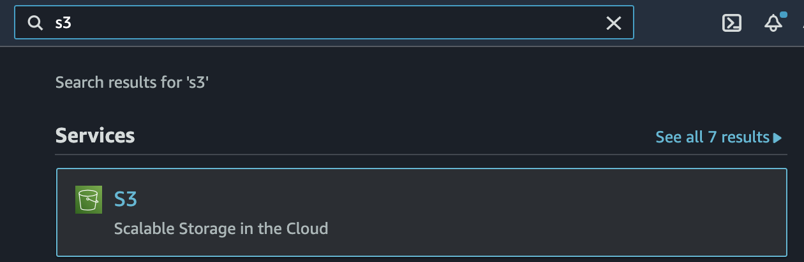 
           
    - Select Create bucket button
      
      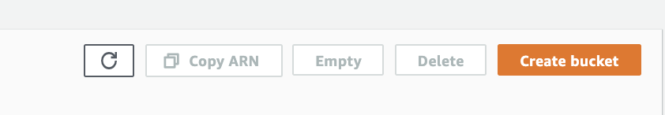
    
    - Enter a Bucket name which globally unqiue
      
      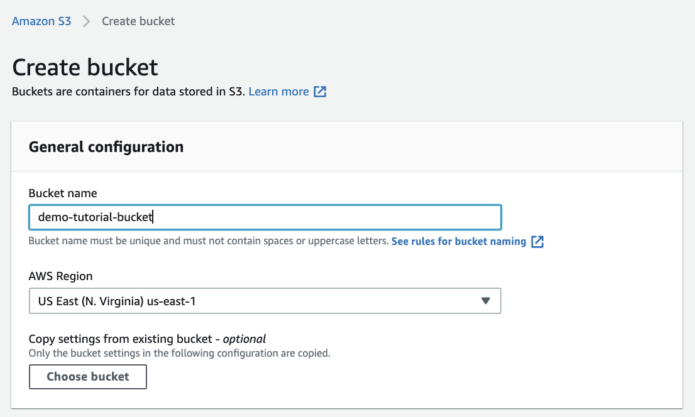 
      
    - Leave rest else as default and click Create bucket

      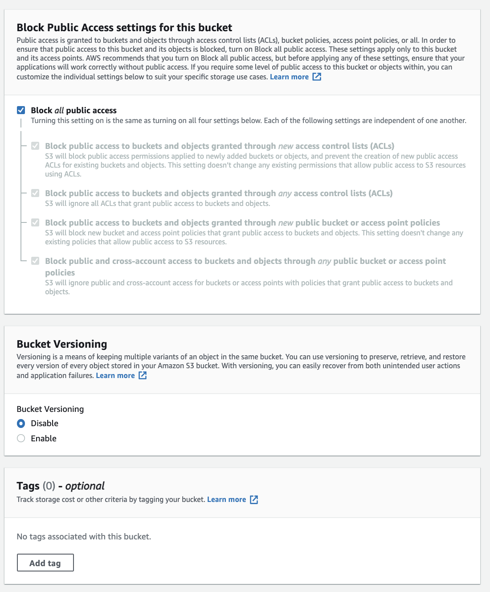
      
      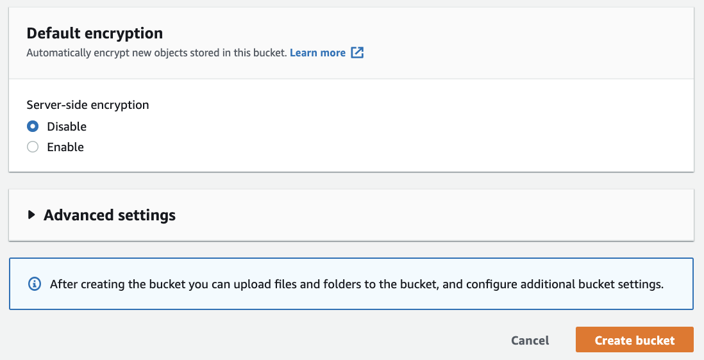
    
    - Verify that bucket is created successfully 
      
      

2. Configure Athena to persist result at right location

    - Navigate to S3 console

      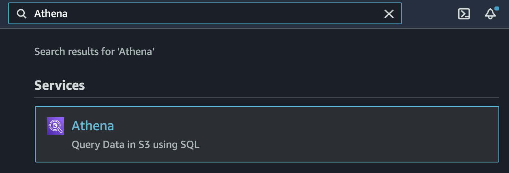 

    - Select on Get Started

       

    - Select on Settings at top right corner of the screen

      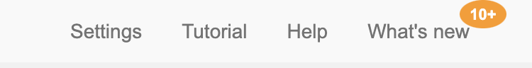 

    - Enter Query result location with your S3 bucket and select Save button in the bottom

      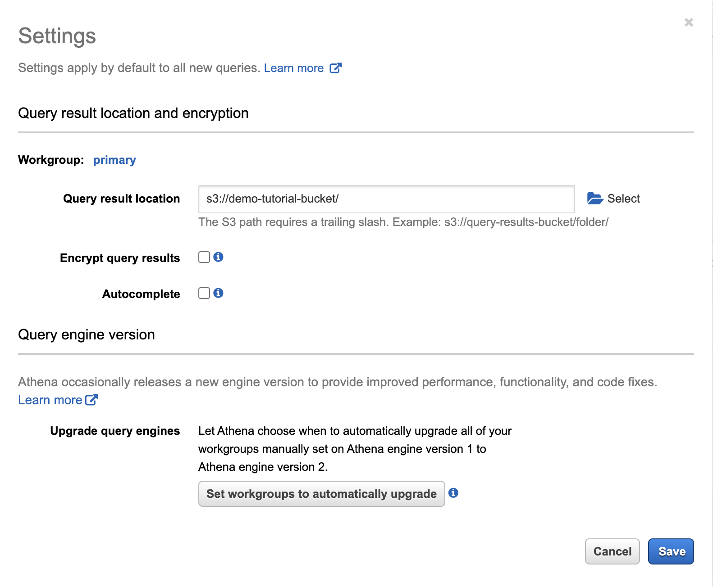 

3. Link Cloudtrail with AWS Athena

    - Navigate to S3 console

      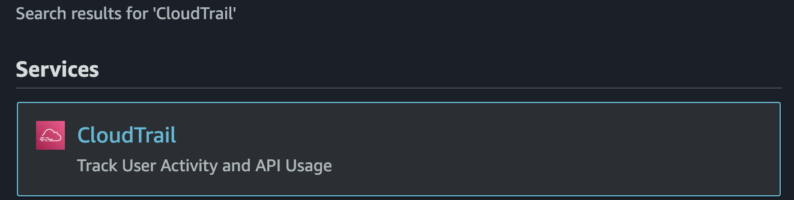 

    - Select Create Athena Table

      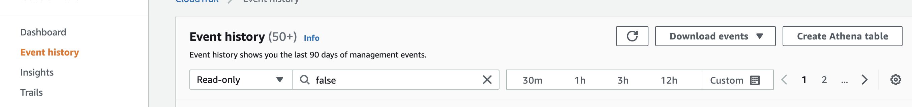 

    - Choose Storage location from the dropdown where Cloudtrail logs are persisted and Click on Create table 

      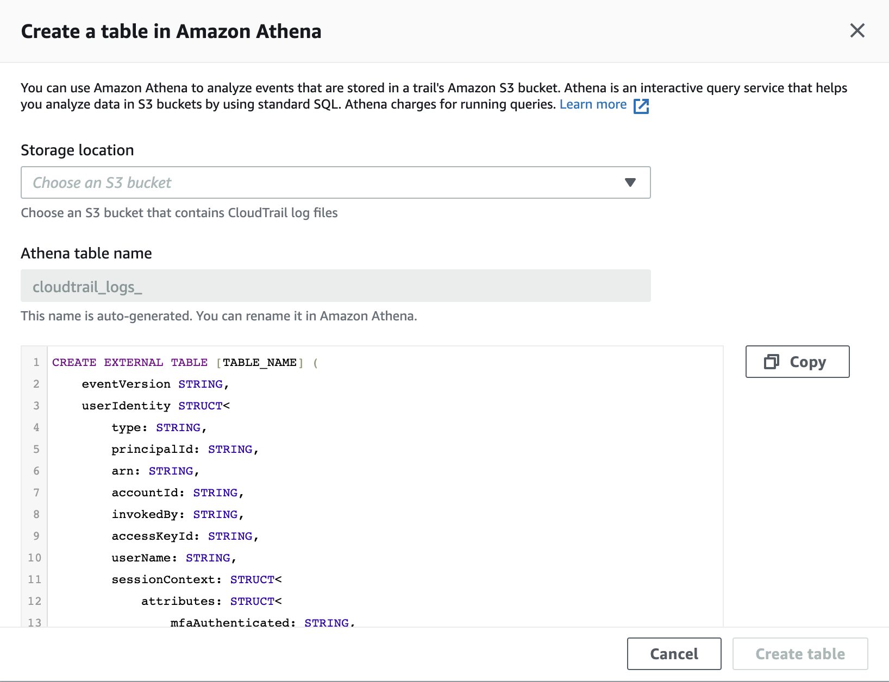 

4. Switch back to AWS Athena console

    - On the left, choose default Database and you will see the Athena Table Name

      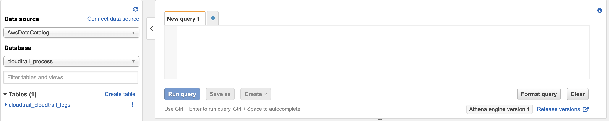 

    - Execute a Select query with limit rows to verify the configuration 

      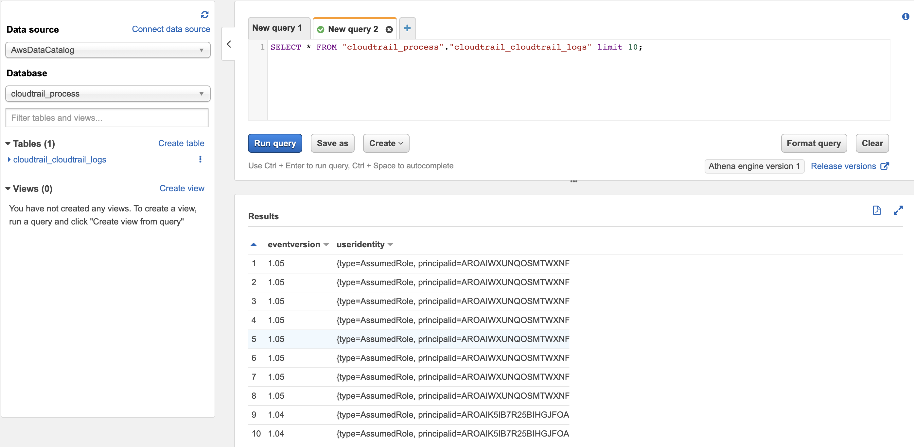
  
5. Retrieve insights from Athena table

    - AWS Sign-in activity: The below query provides user-level details with respect to the AWS console login event
 
           SELECT *
            FROM cloudtrail_cloudtrail_logs
            WHERE eventname = 'ConsoleLogin'
    
   
